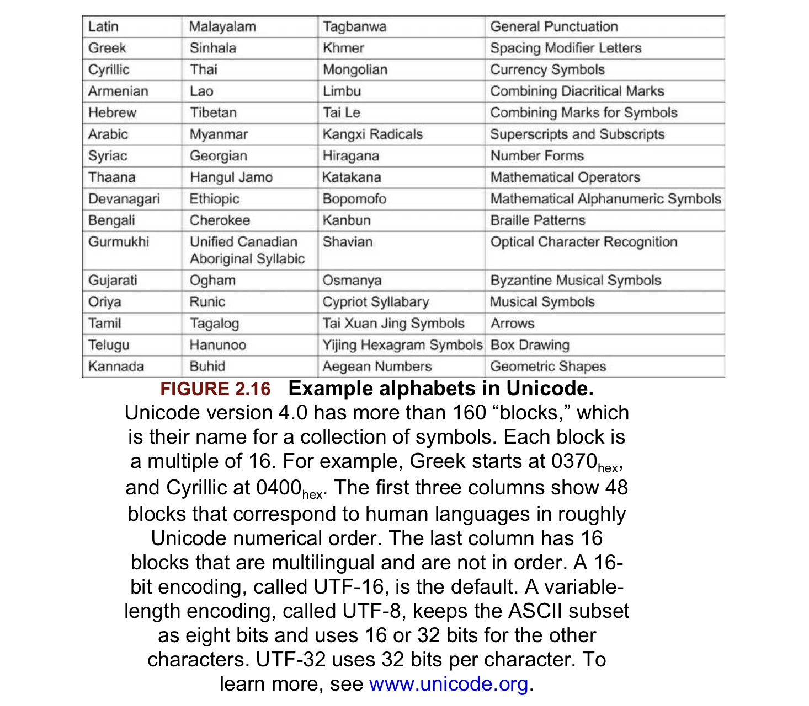

# Introduction

## Instruction set

被计算机体系结构所理解的命令的词汇表 （指令集）

## Stored-program concept

在这种概念里，指令以及相关数据都被存储在内存中（Memory）

## 相关指令集如下：


# 2.2 计算机硬件的操作(Operations of Computer Hardware)

任何计算机都能进行运算操作。

## 在RISC-V中，例如加法运算可用如下指令表示：

```apl
a=b+c
d=a-e
```

```assembly
add a, b, c //a=b+c
sub d, a, e //d=a-e
```

```apl
f=(g+h)-(i+j)
```

```assembly
add t0, g, h //将运算结果存储在临时变量t0中
add t1, i, j
sub f, t0, t1
```

很明显，运算操作中，每一条指令都有三个操作数，两个用于计算，一个用于存储结果。这种思想体现了一种原则：有规律的往往是简单的 （Simplicity favors regularity）

# 2.3 计算机硬件的操作数 (Operands of Computer Hardware)

## Operands

用于进行计算操作的数

这些操作数必须被读取到寄存器中进行运算（register），在RISC-V中，register的大小是64 bits。RISC-V中有32个register，operands 必须取自32个64bits的register之中。

## double word

64 bits

## word

32 bits

## 用寄存器的指令集

```apl
f=(g+h)-(i+j)
```

假设变量f,g,h,i,j分别存储在x19,x20,x21,x22,x23

```assembly
add x5, x20, x21 //临时变量存储在寄存器x5 x6中
add x6, x22, x23
sub x19, x5, x6
```

## 内存操作数 （Memory Oprands）

由于寄存器的数量很少，并且运算只能在寄存器上进行，所以一些结构体数据和数组数据都存储在内存中（Memory）。RISC-V提供了在寄存器和内存中传输数据的指令，要获得内存中的数据，指令必须有数据在内存中的地址（操作数之一）。内存是一个很大的一维的数组，地址相当于对数组的引用，从0开始，在RISC-V中每个地址单元代表一个byte (8 bits)。

*数据从内存传输到寄存器叫做 load* ，加载doubleword 的指令是 ld 。例如：

```apl
g=h+A[8]
```

 假设变量g,h存储在x20,21，数组的地址存储在x22

```assembly
ld x9, 64(x22) // 先将A[8]从内存中读取到寄存器x9中作为临时变量，由于doubleword是8字节，8个doubleword需要64字节，所以第9个(数组下标从0开始)起始地址是base address加上64个字节
add x20, x21, x9 //g=h+A[8]
```

*数据从寄存器存储到内存中叫做 store*，存储doubleword的指令是 sd。例如：

```apl
A[12]=h+A[8]
```

假设如上

```assembly
ld x9, 64(x22) //临时变量存储到x9
add x9, x9, x21
sd x9, 96(x22) //A[12]=h+A[8]
```

## 操作数之常量和立即数(Constant or Immediate Operands)

寄存器中读取数据和操作数据是最快的，有的时候指令中需要常数，但是常数存储在内存中，这样会大大降低效率，例如：

```assembly
ld x9, ConstantOffset(x3) //x9=constant， constant在内存中
add x22, x22, x9 //x22=x22+x9 x9相当于是常数
```

RISC-V提供了可以直接运算常量的指令，例如add immediate ==> addi，例如:

```assembly
addi x22, x22, 4 //x22=x22+4
```

常量0是寄存器x0，x0被硬接线为0。

# 2.4 符号数和无符号数（Signed and Unsigned Numbers）

## binary digit

简称bit，二进制其中之一，0或1

## least significant bit

在RISC-V中，一个doubleword中最右边的bit是*least significant bit*

## most significant bit

同样的，一个doubleword中最左边的bit是*most significant bit*

一个doubleword可以表示0～$$2^{64}-1$$的数，n位的二进制可以表示0~$$2^{n}-1$$的数，可以通过等比数列求和计算得出。

## Two's complement (二的补码)

为了使计算机能够运算负数，并且为了简单化，最终的解决方法就是使用*Two's complement*，即把doubleword的*leading 0s*（第63位及往左都是0）表示正数，*leading 1s*（第63位及往左都是1）表示负数。例如：
$$
\begin{aligned}
00000000\,00000000\,00000000\,00000000\,00000000\,00000001&=1_{ten}\\
10000000\,00000000\,00000000\,00000000\,00000000\,00000001&=-2^{63}+1_{ten}\\
11111111\,11111111\,11111111\,11111111\,11111111\,11111101&=-2^{63}+2^{63}-1-2^{1}=-3_{ten}
\end{aligned}
$$
计算时将第63位的数字乘以负数加上62~0位的所有数字。*signed doubleword*能表示 $$-2^{63}$$~$$2^{63}-1$$的数。

## 计算符号数字的简便方法

### 倒置法 （invert 0 to  1 and 1 to 0）

在符号数字中111…111表示-1，所以$$\bar{x}+x=-1$$，因此$$\bar{x}+1=-x$$ ($$\bar{x}$$表示$$x$$的倒置)。例如：
$$
\begin{aligned}
x=&00000000\,00000000\,00000000\,00000000\,00000000\,00000010=2_{ten}\\
\bar{x}=&11111111\,11111111\,11111111\,11111111\,11111111\,11111101\\
\bar{x}+1=&11111111\,11111111\,11111111\,11111111\,11111111\,11111101\\+\\
&00000000\,00000000\,00000000\,00000000\,00000000\,00000001\\
=&11111111\,11111111\,11111111\,11111111\,11111111\,11111110\\
=&-2_{ten}
\end{aligned}
$$

# 2.5 在计算机中表示指令集(Representing Instructions in the Computer)

指令集在计算机中以一系列高低电信号存储。指令集的每一部分都可以被看作一个独立的数字，将这些数字放在一起就能形成指令。RISC-V中的32个寄存器可以从0~31引用。

## 将汇编翻译成机器指令

例如：

```assembly
add x9, x20, x21
```

十进制表示法是

```apl
0 21 20 0 9 51
```

该指令的每一个数字成为一个字段（field），第一个，第四个，第六个字段（0 0 51）一起告诉计算机该指令执行加法操作（addition）。第二个字段（21）表示第二个源操作数寄存器的数字（x21），第三个字段（20）表示另外一个源操作数寄存器的数字，第五个字段（9）表示存放最终结果的寄存器的数字（x9）。该指令也可以表示为二进制数字：

| 0000000 | 10101  | 10100  |  000   | 01001  | 0110011 |
| :-----: | :----: | :----: | :----: | :----: | :-----: |
| 7 bits  | 5 bits | 5 bits | 3 bits | 5 bits | 7 bits  |
|    0    |   21   |   20   |   0    |   9    |   51    |
| funct7  |  rs2   |  rs1   | funct3 |   rd   | opcode  |

RISC-V的每一条指令都是32bits大小，上图表格中的指令布局称为指令格式（instruction format）。

### Machine language

为了与汇编语言区分，二进制表示的指令称为机器语言。

## RISC-V字段（field）

以上面的加法指令为例子，其中的字段可以表示成：

| funct7 |  rs2   |  rs1   | funct3 |   rd   | opcode |
| :----: | :----: | :----: | :----: | :----: | :----: |
| 7 bits | 5 bits | 5 bits | 3 bits | 5 bits | 7 bits |

以上字段的名字的意义是：

- **opcode** ：指令的基本操作
- **rd**：最终目标寄存器操作数，能够得到指令操作的结果
- **funct3**：额外的 opcode 字段
- **rs1**：第一个寄存器源操作数
- **rs2**：第二个寄存器源操作数
- funct7：额外的 opcode 字段

### opcode

一种能够指明操作和指令格式的字段

## R-type format (for register) 

R-type 格式如以上所示指令格式所示，主要用于寄存器的操作。

## I-type format (operation with one constant operand) 

I-type 格式主要用于有一个常数操作数的指令，例如*addi*、*load* 等等。大致上，I-type 格式如图示：

| immediate |  rs1   | funct3 |   rd   | opcode |
| :-------: | :----: | :----: | :----: | :----: |
|  12 bits  | 5 bits | 3 bits | 5 bits | 7 bits |

12bit 大小的immediate代表二的补码的数值，即可以表示$$-2^{11}$$~$$2^{11}-1$$的十进制数值。当I-type 用于load指令时，immediate代表字节偏移量（byte offset），rs1表示存储内存中起始地址（base address）的寄存器源操作数，相当于在内存地址中寻找*rs1+immediate*。因此*ld* (load doubleword) 指令能够在*rs1*(base address)的基础上寻找地址在区域$$\pm{2^{11}}$$之间的doublewords。

## S-type format (split immediate into two fields)

S-type 格式将immediate分成了两个字段，这样做是为了保持rs1和rs2在所有指令格式中处于相同的位置，如*sd*（store doubleword）。其中的字段如下：

| immediate[11:5] |  rs2   |  rs1   | funct3 | immediate[4:0] | opcode |
| :-------------: | :----: | :----: | :----: | :------------: | :----: |
|     7 bits      | 5 bits | 5 bits | 3 bits |     5 bits     | 7 bits |

同样的，所有指令中opcode 和 funct3也同样在一样的位置，指令的格式通过opcode进行区分，所以opcode位于二进制的第一个位置，硬件首先读取opcode，之后才能知道怎样处理剩下的指令部分。

## 举例

假设数组A的基础地址是x10，变量h存储在x21，翻译成机器语言：

```apl
A[30]=h+A[30]+1;
```

首先翻译成汇编：

```apl
ld x9, 240(x10) //将A[30]从内存读取到临时寄存器x9
add x9, x21, x9 //x9=A[30]+h
addi x9, x9, 1 //x9=x9+1
sd x9, 240(x10) //将最终结果存储到A[30]
```

其次将每条指令翻译成机器语言

*ld x9, 240(x10)*：

|  immediate   |  rs1  | funct3 |  rd   | opcode  |
| :----------: | :---: | :----: | :---: | :-----: |
|     240      |  10   |   3    |   9   |    3    |
| 000011110000 | 01010 |  011   | 01001 | 0000011 |

*add x9, x21, x9*：

| funct7  |  rs2  |  rs1  | funct3 |  rd   | opcode  |
| :-----: | :---: | :---: | :----: | :---: | :-----: |
|    0    |   9   |  21   |   0    |   9   |   51    |
| 0000000 | 01001 | 10101 |  000   | 01001 | 0110011 |

*addi x9, x9, 1*：

|  immediate   |  rs1  | funct3 |  rd   | opcode  |
| :----------: | :---: | :----: | :---: | :-----: |
|      1       |   9   |   0    |   9   |   19    |
| 000000000001 | 01001 |  000   | 01001 | 0010011 |

*sd x9 240(x10)*

| immediate[11:5] |  rs2  |  rs1  | funct3 | immediate[4:0] | opcode  |
| :-------------: | :---: | :---: | :----: | :------------: | :-----: |
|        7        |   9   |  10   |   3    |       16       |   35    |
|     0000111     | 01001 | 01010 |  011   |     10000      | 0100011 |

# 2.6逻辑操作（Logical Operations）

|                逻辑操作                 | C 操作符号 | Java 操作符号 | RISC-V 指令 |
| :-------------------------------------: | :--------: | :-----------: | :---------: |
|            Shift Left (左移)            |     <<     |      <<       |  sll, slli  |
|           Shift Right (右移)            |     >>     |      >>>      |  srl, srli  |
| Shift Right arithmetic (可以计算符号数) |     >>     |      >>       |  sra, srai  |
|           Bit-by-bit AND (与)           |     &      |       &       |  and, andi  |
|           Bit-by-bit OR (或)            |     \|     |      \|       |   or, ori   |
|   Bit-by-bit XOR (exclusive or 异或)    |     ^      |       ^       |  xor, xori  |
|           Bit-by-bit NOT (非)           |     ~      |       ~       |    xori     |

## Shift

Shift 分为*Shift Left*和*Shift Right*，左移(Shift Left)相当于将原先的bits往左移动n个bits，右边空出来的bits用0填充，相当于乘$2^n$；右移则相反，srli (shift right logical immediate) 将左边空出来的bits用0填充，srai (*shift right arighmetic immediate*)将左边空出来的bits用sign bit填充。指令例如：

```apl
slli x11, x19, 4 // x11 = x19 << 4 bits
```

Shift left logical immediate (slli) ，使用 I-type 格式，由于bit移动超过63bits对于64bits的寄存器来说是毫无意义的，所以*slli*只使用immediate的最低的6bits ($2^6-1=63$)。剩下的6bits以额外的opcode字段(funct6)使用：

| funct6 | immediate |  rs1   | funct3 |   rd   | opcode |
| :----: | :-------: | :----: | :----: | :----: | :----: |
|   0    |     4     |   19   |   1    |   11   |   19   |
| 6 bits |  6 bits   | 5 bits | 3 bits | 5 bits | 7 bits |

## AND

与操作，将两个数按位操作，同为1则1，否则为0

## OR

或操作，同样按位操作，如果有1则为1，否则为0

## XOR

异或操作，同样按位操作，如果两个位不同则为1，否则为0

## NOT

非操作，只有一个操作数，将0变成1，1变成0

# 2.7 条件指令 (Instructions for Making Decisions)

RISC-V包括两个decision-making指令：

```apl
beq rs1, rs2, L1
```

**branch if equal**，这条指令的意思是，如果rs1等于rs2，就跳转到标记为L1的声明。

```apl
bne rs1, rs2, L1
```

**branch if not equal** ，与上面的指令相反。

## Conditional branch

一条指令能够测试数值，并且允许通过测试的结果来把控制权转移到程序的新的地址。

例如：

```apl
if (i==j)
	f=g+h;
else
	f=g-h;
```

假设变量 *f g h i j* 存储在 *x19 ~ x23* 中，以上代码的汇编是：

```apl
bne x22, x23, Else // go to Else if i != j
add x19, x20, x21 // f=g+H
beq x0, x0, Exit // 退出，条件永久成立 if 0==0 exit
Else: sub x19, x20, x21 // f=g-h (如果i!=j)
Exit:
```

## Loops

### 编译C中典型的loop：

```apl
while (save[i]==k)
    i+=1;
```

假设 *i k* 存储于 *x22 x24* ，数组 *save* 的 *base address* 存储于 *x25*。

首先需要将save[i]从内存中读取到临时寄存器中，在此之前，需要计算save[i]在内存中的地址，由于每一块地址是一个字节(byte) ，因此一个64bits的doubleword需要8个字节，因此计算地址时，i需要乘8，可以通过左移3实现。然后需要标记为loop的指令，这样可以实现循环。

```apl
Loop: slli x10, x22, 3 // temp reg x10=i<<3 (临时寄存器x10=i*8)
add x10, x10, x25 // x10=address of save[i] , 相当于i*8(x25)
ld x9, 0(x10) // temp reg x9=save[i]
bne x9, x24, Exit // if save[i] != k exit
addi x22, x22, 1 // i+=1
beq x0, x0, Loop // if x0==x0 Loop
Exit:
```

## 其他条件指令

除了对比相等性(bne,beq)以外，RISC-V还提供了其他用于对比两个操作数的指令，例如 *less than ($<$) ，less than or equal ($\leq$)， greater than ($>$) ，greater than or equal ($\geq$)* 。

RISC-V提供了不同的指令用于对比符号数和无符号数。*blt* (branch if less than) 当$rs1<rs2$时跳转，*bge* (branch if greater or equal) 当$rs1\geq{rs2}$ 时跳转。等等，这些指令都用于对比二的补码的数值，即符号数。

*bltu* (branch if less than unsigned) ，*bgeu* (branch if greater than or equal , unsigned) 用于对比无符号数。

## 检查边界溢出的简便方法

当检查$0\leq{x}<y$时 (例如数组的下标)，如果把x当作无符号数看待，那么如果x的最高位是1，则在符号数中x<0，并且在无符号数中x>y (数组边界y一定是正数,则y的最高位一定是0,内存从0开始);所以如果以无符号数检测到x>=y，则一定是边界溢出，所以只需要以下一条指令：

```apl
bgeu x20, x11, IndexOutOfBounds // if x20>=x11 or x20<0, goto IndexOutOfBounds
```

# 2.8 函数(Procedures)

一个*Procedure* 或者函数(*Function*)是用来更好地组织程序的工具，让程序更加容易理解和复用。

## Procedure (Function)

一种被存储的子程序，基于给定的参数执行特殊的任务。

执行一个Procedure需要执行以下几个步骤：

1. 父程序(Calling program)将参数放置在Procedure可以获取的地方
2. 将控制转移到Procedure
3. 获取Procedure需要的存储资源
4. 执行任务
5. 将结果放在主程序可以获取的地方
6. 将控制权转移至父程序

RISC-V约定以下寄存器用于Procedure：

- *x10-x17*：8个寄存器用于传递参数或者返回结果
- *x1*：一个返回地址寄存器，用于回到原点(调用Procedure的地方)

## jal

除了分配这些寄存器，RISC-V包含一个专门给Procedure的指令：在跳转到一个地址的同时将之后接下来要执行的指令地址存储到x1(即调用完Procedure后要执行的指令的地址)-----> ***jump-and-link instruction*** (**jal**)，例如：

```apl
jal x1, ProcedureAddress // jump to ProcedureAddress and write return address to x1
```

## return address

一个地址用于从Procedure返回到父程序(caller)，存储在x1。在RISC-V中使用*jalr* 返回到caller：

```apl
jalr x0, 0(x1) // just branch to instruction address in x1
```

(有点奇怪，但是似乎这条指令到存储在x1地址中取出了指令，因为有0(x1) )

## Program Counter

RISC-V包含一个**Program Counter**(程序计数器)用于存储当前执行的指令的地址（虽然更应该叫*instruction address register*，但书上这么说），由于指令是32bits，所以需要4字节，那么相邻的下一条指令的地址则是**PC+4**，在跳转至Procedure前，jal将PC+4写入x1，以此设置返回地址。

## 使用更多的寄存器（using more registers）

当返回父程序指令地址时，父程序所使用的寄存器必须恢复在调用Procedure之前存储的数据（不能被Procedure覆盖），由于寄存器数量只有32个，所以只能将数据缓存到内存中。

用于实现这样的思想的数据结构是栈（**stack**）。

## Stack(栈)

stack是一种最后进第一个出的队列（last in first out），stack存储在内存之中，其中存储寄存器中的数据，stack需要一个指针指向stack中最新分配的内存。stack pointer在RISC-V中是x2，用于存储栈顶的地址(stack top)。每存储或恢复（删除）一个寄存器的数据，stack都需要调整一个doubleword大小的内存，因为每一个寄存器都是64bits的。将数据存储到stack叫作**push**，从stack移除数据叫作**pop**。

在RISC-V中，**stacks grow from higher addresses to lower addresses**，也就是说，每存储一个寄存器的数据，stack pointer的地址就减少8，反之亦然。

## 编译一个Leaf Procedure (不调用其他函数的函数)

假设 *g,h,i,j* 存储在 *x10,x11,x12,x13* 上，*f* 存储在 *x20* 里。

```c
long long int leaf_example(long long int g,long long int h
                           , long long int i,long long int j)
{
    long long int f;
    f=(g+h)-(i+j);
    return f;
}
```

首先需要函数的标签 *leaf_example:*，然后在内存的*stack*中存储*procedure*需要用到的寄存器中原有的值，然后执行函数体里面的指令，最后从内存stack中恢复先前存储的寄存器的值。

```apl
leaf_example:
addi sp, sp, -24 //在stack中开辟新的24字节内存用于存储3个寄存器，一个寄存器64位大小(8字节)
sd x5, 16(sp) //将寄存器x5中原有的值存储在stack中，sp(16)为起始的内存地址，8字节
sd x6, 8(sp) //同样将寄存器x6中原有的值存储在stack中
sd x20, 0(sp)
add x5, x10, x11 // x5=g+h
add x6, x12, x13 // x6=i+j
sub x20, x5, x6 //f=(g+h)-(i+j)
addi x10, x20, 0 // x10=f+0 将procedure最终结果存储在寄存器x10中，遵循RISC-V的约定
ld x20, 0(sp) //恢复存储在stack中的值
ld x6, 8(sp)
ld x5, 16(sp)
addi sp, sp, 24 //从stack中pop出24字节
jalr x0, 0(x1) //返回到存储在x1中的指令地址（caller）
```

## 在RISC-V中有关是否存储寄存器的值有以下约定

- *x5-7* 和 *x28-x31* : 临时寄存器，不需要被Procedure维护
- *x8-x9* 和 *x18-x27* : 在调用Procedure时必须维护先前的值

## Nested Procedures

一个Procedure里调用另一个Procedure。

## 编译一个递归函数(Recursive Procedure)

```c
long long int fact (long long int n)
{
    if (n<1)
        return 1;
    else
        return n*fact(n-1);
}
```

```apl
fact:
addi sp, sp, -16 // 在stack中开辟2个doubleword用于存储寄存器的值
sd x1, 8(sp) // 将x1原有的值（caller指令的地址）存储在stack中
sd x10, 0(sp) // 将原先x10的值(原本的函数参数)存储在stack中
addi x5, x10, -1 // 临时寄存器 x5=n-1
bge x5, x0, L1 // if x5>=0 (即n>=1), go to L1
addi x10, x0, 1 // x10=1+0 如果n<1,则返回结果1,将1存储在寄存器x10中
addi sp, sp, 16 // pop 16 bytes out of stack,由于没有重新覆盖x1,所以不需要ld
jalr x0 0(x1) // return to caller
L1: addi x10, x10, -1 //if n>=1, n=n-1, n作为参数存储在x10中
jal x1, fact // 调用 fact(n-1),并将此Procedure的下一条指令地址存入x1中
addi x6, x10, 0 //此时x10存储fact(n-1)返回的结果,将结果移动到x6中
ld x10, 0(sp) //恢复x10原先的值,即对于正在执行的Procedure的参数n
ld x1, 8(sp) //恢复x1原先的值,即对于正在执行的procedure的caller
addi sp, sp, 16 // pop 16 bytes out of stack
mul x10, x10, x6 //x10=n*fact(n-1) 将此结果存入x10中
jalr x0, 0(x1) // return to the caller

```

重新梳理一下，假设调用了函数**fact(4)**，那么此时**x10**存储的**n**为4，首先将**x1,x10**的值存储在栈中，由于n>=1，则执行**L1**语句，执行**n=n-1**，此时**x10**存储的值为3，作为下一次调用**fact**的参数**n**，然后执行**jal x1, fact**，此时x1的值为caller 中**addi x6, x10, 0**的地址，继续重复执行，直到**fact(2)**调用**fact(1)**时，**fact(1)**将1存储在**x10**中，然后返回到**fact(2)**，**fact(2)**将**fact(1)**返回的结果移至**x6**，由于**fact(2)**存储在stact中**x10**中的值为2，于是恢复x10，此时x10为2，将**x10=x10*x6**的值存入**x10**，即n\*fact(n-1)，然后返回到**fact(3)**，返回结果为**2\*1**（n\*fact(n-1)），对于**fact(3)**亦是如此，**fact(3)**取出存储在stack中的**x10**为3，将结果**3\*2\*1**存储在**x10**中，并返回到**fact(4)**。在**fact(4)**中，取出存储在stack中的**x10**的值为4，将结果**4\*3\*2\*1**存储在**x10**中，并返回到调用**fact(4)**的**caller**。

## Global pointer

像C语言中，一个函数中定义的变量如果不用*static*修饰则会在函数调用结束时释放变量的内存，如果使用*static*修饰则不会释放变量的内存。在RISC-V中，寄存器**x3**用于指向在内存中存放*static*数据的区域，称为**Global Pointer**

## Preserved or Not preserved Registers During Procedure Call

|                    Preserved                     |                        Not preserved                         |
| :----------------------------------------------: | :----------------------------------------------------------: |
|       Saved registers: **x8-x9, x18-x27**        |           Temporary registers: **x5-x7, x28-x31**            |
|       Stack pointer register: **x2** (sp)        |            Argument/result registers: **x10-x17**            |
|       Frame pointer register: **x8 (fp)**        |                                                              |
|       Return address register: **x1 (ra)**       |                                                              |
| Stack above the stack pointer (在栈指针上面的值) | Stack below the stack pointer (在栈指针下面的值,栈指针指的是caller的栈指针) |

## Frame Pointer & Procedure Frame

在调用Procedure时，Procedure在*stack*中存储的本地变量，比如数组，结构体等等，都存储在**Procedure Frame**中，（包括需要存储的寄存器）。**Frame Pointer**则指向第一个Procedure存储的数据，通常是**saved argument register**(x10-x17)。通俗地讲就是，Procedure 在Caller的 *sp* 以下的区域开辟的内存就是 *Procedure Frame*，而 *Frame Pointer*指向这片区域的第一个*double word*。**Frame Pointer**的好处是能够更加方便的从Procedure Frame 中取值，并且恢复*sp*时只需要使用**Frame Pointer**即可。


## 在堆(Heap)中给数据分配内存

在C语言中，有一块内存空间专门存储*static*变量和*dynamic data structures*。例如在linux中，有一块*user addresses space*，在这个**用户内存地址空间**中，*stack*从最高处开始，往下扩容。最低处的内存是被保留的(preserved)，紧接着往上是存储机器代码的地方(home of machine code)，通常叫做**text segment**。再往上就是**static data segment**，这里存储常量和静态数据。尽管**数组**具有固定的长度，而**链表(linked lists)**可以增加或者减少大小，他们都被存储在**堆(heap)**中，在static data segment的上面，并且往上扩容。


*user address* 的长度为 $2^{38}$ of  $2^{64}$ (总的地址空间为64位，但是地址只取其中的38位)。如上图所示，**stack pointer**初始化为 *$0000\,003f\,0040\,0000_{hex}$*，并且往下朝着**Dynamic data**扩容。在另一端，**text segment**开始于 *$0000\,0000\,0040\,0000_{hex}$* 。**static data**开始于**text segment**结束的地方，在这里假设开始于$0000\,0000\,1000\,0000_{hex}$ 。再往上便是**Dynamic data**，并且向上朝着**stack**扩容，这一部分叫做**堆(heap)**。在C中使用*malloc*分配堆中的内存，在Java中使用*new*分配堆中的内存。

### text segment

在user address中存放机器代码的地方

## 在Procedure中使用超过8个参数

RISC-V约定将多余的参数(超过8个)放置在*stack*中，并且就在*frame pointer*之上。也就是说调用Procedure时第一个到第八个参数放置在寄存器x10到x17中，剩余的参数放置在内存中，并且能够被frame pointer寻址。

## 使用迭代编译递归函数

有一些递归函数可以使用迭代实现，这样可以减少递归的开销。例如：

```C
long long int sum(long long int n, long long int acc)
{
    if(n>0)
        return sum(n-1,acc+n);
    else
        return acc;
}
```

假设调用*sum(3,0)*，在调用过程中，函数会递归地调用*sum(2,3) sum(1,5) sum(0,6)*，然后结果*6*会被返回4次。这样的函数可以十分高效地实现，假设n存放在x10中，acc存放在x11中：

```apl
sum:
ble x10, x0, sum_exit // go to sum_exit if n<=0
add x11, x11, x10 // acc=acc+n
addi x10, x10, -1 //n=n-1
jal x0, sum // jump to sum
sum_exit:
addi x12, x11, 0 // return acc (将结果放在寄存器x12中)
jalr x0, 0(x1) // 返回到caller
```

# 2.9 交互(Communicating with People)

## ASCII

*American Standard Code for Information Interchange*。大多数计算机使用8位的字节表示一个字符，并且遵循ASCII标准。


## Load byte

RISC-V提供了一系列移动字节(bytes)的操作。*Load byte unsigned (lbu)*从内存中加载字节到寄存器最右边的8位中，并用0填充剩下的56位；*Load byte (lb)*用符号位填充剩下的56位。*Store byte (sb)*将寄存器最右边的8位(1字节)存储到内存中。例如:

```apl
lbu x12, 0(x10) // read byte from memory into register x12
sb x12, 0(x11) // store byte from register x12 into memory 
```

类似的操作还有 *Load half unsigned*(lhu) 移动16bits、*Load word unsigned (lwu)*移动32bits。

## String

字符串由多个字符组成，一般都会有以下3种选择表示字符串：

1. 字符串的第一个位置保留用来表示字符串的长度
2. 用一个伴随变量表示字符串的长度（比如在结构体中）
3. 用字符串的最后一个位置标记结束

C语言使用了第三个选项，使用*0*(在ASCII中表示为null)标记字符串的结尾。比如"Cal"被表示成 67 97 108 0 。Java使用了第一个选项。

## 编译Strcpy

strcpy函数将字符串y复制到字符串x中，并以null（'\0'）结尾。

```C
void strcpy(char x[], char y[])
{
    size_t i;
    i=0;
    while((x[i]=y[i])!='\0') // copy y into i until the end of y
        i+=1;
}
```

假设数组x和y的base address分别存储在寄存器x10和x11中，i存储在x19中。首先函数将x19的值先存储在栈中。

```apl
strcpy: 
addi sp, sp, -8 //向下扩容8字节，一个寄存器64位，即8字节
sd x19, 0(sp) // save x19 into stack
add x19, x0, x0 // 初始化i=0, i=0+0
L1: add x5, x19, x11 // address of y[i], and store it into x5 temporarily,字符以字节存储，所以此时y+i就是字符y[i]在内存中的地址
lbu x6 0(x5) //x6=y[i]
add x7, x19, x10 // address of x[i] (x+i) in x7
sb x6 0(x7) // store y[i] into x[i]
beq x6, x0, L2 // if x[i]==0 (这里比较的是转换成二进制后的值，并不是数值0) then go to L2
addi x19, x19, 1 // i=i+1
jal x0, L1 // go to L1 and loop
L2: ld x19 0(sp) // restore x19 from stack
addi sp, sp, 8 // pop 1 doubleword off stack
jalr x0, 0(x1) // return to caller
```

## Java中的字符和字符串

### Unicode

Universal encoding ，能够对大部分语言进行编码。为了更好的兼容性，Java使用Unicode表示字符，默认使用16位表示一个字符。UTF-16使用16位表示一个字符；UTF-8保留了8位的ASCII字符，使用16位表示其他字符；UTF-32使用32位表示一个字符。




# 2.10 RISC-V对于大立即数或地址的寻址(RISC-V Addressing for Wide Immediates and Addresses)

尽管将所有RISC-V指令保持在32位大小能够简化硬件，但是有的时候需要用到超过32位大小的常数或者地址。这一节将讲解对于较大的常数通用的解决方法。

## Wide Immediate Operands (大立即数操作数)

尽管大多时候常数都能够满足12位的大小，但是有的时候需要用到超出12位的常数。

## Load upper immediate

RISC-V提供了指令*Load upper immediate (lui)*来将20位大小的常数移动到寄存器的第**12-31位**中，并将左边的32位全部用第31位填充(signed bit)，将右边的12位用0填充。这条指令能够将较大的常数存储到寄存器中，例如，将32位的常数使用两条指令存储到寄存器中。*lui* 使用了新的指令格式：**U-type**。

## Example: loading a 32-Bit Constant

将下面64位的常数加载到寄存器中：

$00000000\,00000000\,00000000\,00000000\,00000000\,00111101\,00000101\,00000000$

首先需要将常数的第12位到31位存储到寄存器中：

```apl
lui x19, 976 // 976_decimal=0000 0000 0011 1101 0000
```

我们可以看到，在使用lui时是先将12bit-31bit的常数部分拎出来并单独看成一个新的常数，并将它转换成十进制。此时，寄存器x19的值为：

$00000000\,00000000\,00000000\,00000000\,00000000\,00111101\,00000000\,00000000$

接下来将常数剩余的12位加载到寄存器x19中：

```apl
addi x19, x19, 1280 // 1280_decimal=0101 0000 0000
```

这里使用*addi*，因为12位常数可以满足*addi*指令的格式。但是这也引出了一个问题，如果第11位是0，那么直接相加是没有问题的；但是如果第11位是1，那么由于*addi*是将常数看作符号数的，所以相加时会将剩下的12位看作负数（将左边52位都看作符号位，1），这样显然是错误的加法。为了弥补，如果11位是1，那么计算剩下的12位时应当是：$-2^{11}+\sum_{i=0}^{10}{2^i}*x_i$。也就是说相较于无符号常数，*addi*多减了2个$2^{11}$（无符号整数计算时直接将0-11位转换成2的幂并相加），那么在常数的12-31位中加个1可以解决，因为*lui*是将12-31位单独看作一个常数的，并将其加载到寄存器的12-31位中，相当于左移了12位，即乘$2^{12}$，所以加个1后，$1*2^{12}=2*2^{11}$，刚好抵消。

## 分支中的寻址(Addressing in Branches)

### SB-type （Conditional branch）

RISC-V中的分支指令(branch instruction)使用的指令格式是**SB-type**。这种格式可以表示-4096~4094（需要解释，一个地址单元表示8bits空间，也就是一字节，那么这里其实表示的是地址的标号范围，真实内存空间需要乘字节）的地址(事实上只有12位的立即数只能表示$[-2^{11},2^{11}-1]$之间的地址，书上并没有给出详细解释为什么这里是从第1位到第12位，CS61C给出的解释是，由于立即数一定是偶数的，所以立即数的第0位一定为0，那么就没有必要存储，所以存储了第12位，也就是同样是符号位。详细的内容可以在**slides/lec08/SB-Format中找到**。)，并且是2的倍数，因为地址必须被2整除。**SB-type**由一个7位的opcode，一个3位的function code，两个5位的寄存器操作数(rs1、rs2)和一个12位的地址立即数组成。其中地址立即数使用了特殊的编码，为了简化数据通道(datapath)设计。例如：

```apl
bne x10, x11, 2000 // if x10 != x11, then branch to 2000, 2000_ten=0111 1101 0000
```

能够转换成以下机器代码：

|    0    |  111110   | 01011 | 01010 |  001   |   1000   |    0    | 1100011 |
| :-----: | :-------: | :---: | :---: | :----: | :------: | :-----: | :-----: |
| imm[12] | imm[10:5] |  rs1  |  rs2  | funct3 | imm[4:1] | imm[11] | opcode  |

### UJ-type （Unconditional jump-and-link）

**jal**指令是唯一一条使用**UJ-type**格式的指令。**UJ-type**由一个7位的opcode，一个5位的寄存器操作数和一个20位的地址立即数组成。UJ-type跟SB-type一样，也使用了特殊的立即数编码（例如20位的立即数这里表示1到20位，讲道理应该是0-19才对）。例如：

```apl
jal x0, 2000 // go to address 2000_decimal=0000 0000 0111 1101 0000
```

可以转换成以下机器代码：

|    0    | 1111101000 |    0    |  00000000  | 00000 | 1101111 |
| :-----: | :--------: | :-----: | :--------: | :---: | :-----: |
| imm[20] | imm[10:1]  | imm[11] | imm[19:12] |  rd   | opcode  |

## Branch Offset(分支偏移量)

事实上，当branch指令跳转到指定指令地址时，并不是直接将立即数当作指令地址，如果这样，那么指令地址空间的大小只有$2^{20}$，这显然是不够的。所以，解决方法就是指定一个寄存器，并加上立即数来作为指令在内存中的地址。这样，一个程序就可以使用$2^{64}$大小的内存地址空间（这里解决一下疑惑，$2^{64}$指的是表示内存地址的数有64位，即可以取$2^{64}$不同的地址，每一个地址代表一个字节(8 bits)，所以理论上内存地址空间可以达到$2^{24}$TB）。

## PC-relative addressing

一种将寄存器**Program Counter**与立即数的和作为指令地址的寻址方法。**Program Counter**是当前指令的地址，一般的条件语句都能够在离当前指令地址的$2^{10}$words或$2^{18}$words之内（指令的大小是32 bits，也就是4字节，即一个word）。

## 举例：将下面的汇编代码转换成机器代码

```apl
Loop: slli x10, x22, 3 // temp reg x10=i<<3 (临时寄存器x10=i*8)
add x10, x10, x25 // x10=address of save[i] , 相当于i*8(x25)
ld x9, 0(x10) // temp reg x9=save[i]
bne x9, x24, Exit // if save[i] != k, go to Exit
addi x22, x22, 1 // i+=1
beq x0, x0, Loop // if x0==x0 Loop
Exit:
```

**Loop: slli x10, x22, 3**:

| 指令地址(十进制) |  funt6  | immediate |  rs1   | funt3 |  rd1   |  opcode  | 指令格式 |
| :--------------: | :-----: | :-------: | :----: | :---: | :----: | :------: | :------: |
|      80000       | 00 0000 |  00 0011  | 1 0110 |  001  | 0 1010 | 001 0011 |  I-type  |
|      80000       |    0    |     3     |   22   |   1   |   10   |    19    |          |

**add x10, x10, x25**:

| 指令地址(十进制) |  funt7   |  rs1   |  rs2   | funt3 |  rd1   |  opcode  | 指令格式 |
| :--------------: | :------: | :----: | :----: | :---: | :----: | :------: | :------: |
|      80004       | 000 0000 | 1 1001 | 0 1010 |  000  | 0 1010 | 011 0011 |  R-type  |
|      80004       |    0     |   25   |   10   |   0   |   10   |    51    |          |

因为一条指令是32位，即4字节，由于RISC-V中一个地址是代表字节的，所以下一条地址距离上一条相差4（十进制表示）

****

**ld x9, 0(x10)**:

| 指令地址(十进制) |   immediate    |  rs1   | funt3 |  rd1   |  opcode  | 指令格式 |
| :--------------: | :------------: | :----: | :---: | :----: | :------: | :------: |
|      80008       | 0000 0000 0000 | 0 1010 |  011  | 0 1001 | 000 0011 |  I-type  |
|      80008       |       0        |   10   |   3   |   9    |    3     |          |

**bne x9, x24, Exit**: 

| 指令地址 | imm[12] | imm[10:5] |  rs1   |  rs2   | funct3 | imm[4:1] | imm[11] |  opcode  | 指令格式 |
| :------: | :-----: | :-------: | :----: | :----: | :----: | :------: | :-----: | :------: | :------: |
|  80012   |    0    |  0 0000   | 1 1000 | 0 1001 |  001   |   0110   |    0    | 110 0011 | SB-type  |
|          |         |           |   24   |   9    |   1    |          |         |    99    |          |

Exit的地址在后面，是80024，当前PC的地址就是80012，相差12，也就是0000 0000 1100，但是正如前文所说，这里的立即数12位是1到12位的，所以指令里是0000 0000 0110，注意第12位是符号位的拓展，跟符号位一样。这是PC-relative寻址，所以正真的跳转地址应当是PC+12bytes。

**addi x22, x22, 1**：

| 指令地址(十进制) |   immediate    |  rs1   | funt3 |  rd1   |  opcode  | 指令格式 |
| :--------------: | :------------: | :----: | :---: | :----: | :------: | :------: |
|      80016       | 0000 0000 0001 | 1 0110 |  000  | 0 0110 | 001 0011 |  I-type  |
|      80016       |       1        |   22   |   0   |   22   |    19    |          |

**beq x0, x0, Loop**：

| 指令地址 | imm[12] | imm[10:5] |  rs1   |  rs2   | funct3 | imm[4:1] | imm[11] |  opcode  | 指令格式 |
| :------: | :-----: | :-------: | :----: | :----: | :----: | :------: | :-----: | :------: | :------: |
|  80020   |    1    |  1 1111   | 0 0000 | 0 0000 |  000   |   0110   |    1    | 110 0011 | SB-type  |
|          |         |           |   0    |   0    |   0    |          |         |    99    |          |

Loop的地址是80000，距离此时的PC -20 bytes，即 **1111 1110 1100**（这里是符号数），所以在指令里的立即数是**1111 1111 0110**。

**Exit**:

| 指令地址 |
| :------: |
|  80024   |

## 当条件语句跳转到较远的指令时

如果条件分支指令的目的指令地址距离PC较远，比如超出了12bits的范围，那么编译器会在下一条插入跳转到目标指令的非条件指令（20bits immediate），并且逆转原来的条件分支指令。具体请看：

## Branching far away:

```apl
beq x10, x0, L1 // if x10==0, go to L1
```

假设x10==0，并且L1距离PC超出了12bits所能表示的地址

```apl
bne x10, x0, L2 // if x10!=x0, go to L2
jal x0, L1 // go to L1 unconditionally , this instruction is j
L2: 
```

可以看到，编译器将原来的beq改成了bne，这样如果x10!=0，那么就可以跳转到L2；反之则使用jal跳转到L1。

## 总结

RISC-V的寻址模式有以下几种：（为什么指令中对于操作数的使用叫寻址模式？）

- 立即数寻址：操作数就在指令里面，例如addi
- 寄存器寻址：操作数是寄存器，例如add
- 偏移或基址寻址（base or displacement addressing）: 操作数存储在内存中，其地址是偏移量与寄存器的和，例如jal
- PC-relative寻址： 操作数是偏移量与PC的和，例如bne


# 指令的机器代码总结


**请注意这里的SB-type的opcode是1100111，但是cs61c以及书上的例题中的opcode是1100011**

## 指令格式总结


# 2.11 并发和指令：同步

这一部分其实书里讲的不是很明白，我搜了知乎以后也只是一知半解，如果有不对的地方请自行查阅。

当一些程序在写入数据到内存中时，往往会有另外的程序在读取相同地址的内存数据。为了读取安全进行，程序之间必须同步，否则会造成数据竞争(data race)。

形象点解释就是，当汇报员要总结一篇报道时，必须等到前面的章节都完成了修改并且不再改动。

## Data race

例如两个来自不同线程同时进行的对同一个地址进行内存访问，至少有一个是写入操作，并且连续进行

在这一章节，我们将聚焦于**锁（lock）**和**释放锁（unlock）**的实现。在多元处理器中实现同步机制的核心是一系列支持**原子读写内存**的**硬件基元（Hardware primitives）**。也就是说，在读写内存的时候不能插入其他操作（额，还是查一下谷歌吧，就是不能被打断）。

## 原子操作（Atomic operation)

原子操作(atomic operation)是不需要synchronized，这是多线程编程的老生常谈了。所谓原子操作是指不会被线程调度机制打断的操作；这种操作一旦开始，就一直运行到结束，中间不会有任何 context switch（切换到另一个线程）,来自百度。

## 原子交换（Atomic exchange or Atomic swap）

一个典型的例子就是原子交换，也就是内部交换寄存器和内存的值。

假设我们设置了一个简单的锁，0表示锁是不被占用的，1表示锁已经被占用了。一个处理器尝试通过交换寄存器中的1与内存地址所关联的锁里的内容来设置锁，如果其他处理器已经占用了锁，那么交换操作返回值为1否则为0。如果为0，则该获得锁的处理器将锁设置为1，这样其他处理器就会得到1，也就是说不能获得锁（总之就是锁的值为0表示可以获取锁并写入1，若为1则不能获取锁，也不能写入内容）。

例如有两个处理器同时获得了锁并尝试进行交换，但是这种竞争是会被阻止的，因为硬件会将同时进行的交换进行排序。实现交换同步的核心是操作的原子性：交换是不可分割的。

## 指令对

RISC-V使用指令对来实现原子操作，其中第二条指令返回的值指示指令对是否执行成功（也就是说要么全部成功，要么全部失败，但是这一节书上说的不是很详细，也许后面的章节会详细讲解）。也就是说当指令对执行原子操作时，没有其他处理器可以在指令对之间改变值（或者说不能改变指令对所需要的内存地址中的值以及寄存器中的值），来看下面一个例子：

```apl
again:lr.d x10, (x20)
sc.d x11, x23, (x20)
bne x11, x0, again
addi x23, x10, 0
```

上面的操作使原子交换寄存器**x23**和内存地址**x20**中的值，换句话说要保证在交换过程中**x23**和**x20**的值不能变化。这里使用了RISC-V中的指令对。一个是称为保留加载(**load-reserved**)双字(**lr.d**)的特殊加载指令和一个称为条件存储(**store-conditional**)双字(sc.d)的特殊存储指令。如果保留加载指令指定的内存位置(**x20**)的内容在条件存储指令执行到同一地址之前发生变化（也就是说这个时候内存x20中的值与x10存储的值不一致），则条件存储指令失败，不会将值(**x23**)写入内存(**x20**)中，并且将寄存器**x11**的值改为非零值，然后重复执行(bne x11, x0, again)直到原子操作成功；相反若存储成功则将x11改为0，并执行最后一条语句，即将原先内存地址x20中的值(事先已经存储到x10中)存储到寄存器x23中，实现原子交换。

来看下面一个例子，这里将使用指令对获取存储在内存地址x20中的锁变量：

```apl
addi x12, x0, 1 //复制要存储的锁变量的值
again: lr.d x10, (x20) //读取当前锁变量的值，存储到寄存器x10中
bne x10, x0, again //如果内存地址x20中的锁变量值为0则表示当前锁变量没被占用，否则循环直到锁变量空闲
sc.d x11, x12, (x20) //将要存储的值x12存储到内存地址x20中，1表示占用锁变量，如果x20内存地址中的值在此过程中发生改变则该操作失败，x11被填充非零值，否则x11为0
bne x11, x0, again //如果x11不为0，即占用锁变量失败，则循环进行，直到成功占用锁变量
```

释放锁：

```apl
sd x0, 0(x20) 
```


# 2.12 翻译并启动一个程序
C语言程序转换成计算机可执行程序包括以下步骤：


## 编译器(Compiler)

编译器将C程序转换为汇编语言。

## 汇编器(Assembler) 

汇编器将汇编语言转换成机器语言。

由于汇编语言是高层软件的接口，所以汇编器可以处理一些机器指令的变体，也就是说硬件本身并不支持这些指令，相当于**伪指令**。伪指令能够简化编程。（注意汇编指令与机器指令的区别，机器指令是硬件实现的，而汇编指令只是汇编器能识别）

### 伪指令

一种汇编指令（或许说机器指令更合适呢？？？）的常见变体，可以把它看做汇编指令。

例如：RISC-V硬件确保寄存器**x0**总是取0，因此x0被用于创建汇编语言指令，将一个寄存器的内容复制到另一个寄存器。所以即使以下指令并不存在RISC-V机器语言中，汇编器也能识别它：

```apl
li x9, 123 // load immediate value 123 into register x9
```

汇编器能将上面的指令转换成与以下指令等效的机器语言：

```apl
addi x9, x0, 123 // register x9 gets x0+123
```

RISC-V汇编器还将**mv(move)**指令转换成**addi**指令：

```apl
mv x10, x11  // register x10 gets register x11
```

转换成：

```apl
addi x10, x0, x11
```

汇编器还接受 **j label **作为 **jal x0, label **的替代。总之伪指令为RISC-V提供了比硬件实现更丰富的汇编语言指令系统。

汇编器的主要任务是汇编成机器代码，即将汇编语言程序转换成目标文件（object file），该目标文件是机器指令、数据和将指令正确存放在内存所需信息的组合。

### 符号表(Symbol Tabel)

用于匹配内存中存放指令的地址对应的标签的名字的表（？？？怎么这么奇怪）。

汇编器必须指定所有标签相关的地址，并且在符号表中追踪这些在条件分支中使用的标签和传输数据的指令。

UNIX系统的object file 通常包含以下6个部分：

- object file header: 描述目标文件其他部分的大小以及位置
- text segment: 包含机器语言代码
- static data segment: 包含在程序生命周期中分配的数据
- relocation information(重定位信息): 标记了将程序加载到内存中时依赖于绝对地址的指令和数据
- symbol table: 包含剩余的未定义的标签，例如外部引用
- debugging information: 包含了模块如何被编译的简要描述 ，这样debugger就能将机器指令与C源文件联系并且将数据结构可视化。

## 链接器(Linker)

也叫**Link editor** 。一种系统程序，用来将独立汇编的机器语言程序组合起来，并解析所有未定义的标签，生成可执行文件。

重新编译所有程序是很浪费的，因为有些程序是永远不会改变的。系统程序链接器(**link editor**) 将所有独立汇编的机器语言程序缝合在一起。

分割：妈的这一部分实在读不明白，遂打算放弃，日后有时间再来读一读。

# 2.13 通过一个排序算法串联所学的内容

这里需要两个函数：**swap** 和 **sort** 。

## swap

首先来看swap，交换数组中相邻两个位置的数据

```C
void swap(long long int V[], size_t k)
{
    long long int temp;
    temp=v[k];
    v[k]=v[k+1];
    v[k+1]=temp;
}
```

翻译成RISC-V汇编语言，由前面内容可知，函数的参数存放在寄存器x10-x17中，假设v存放在x10中，k存放在x11中：

```apl
swap:
slli x6, x11, 3 //reg x6=k*8
add x6, x10, x6 //reg x6=v+(k*8), v[k]的起始地址
ld x5, 0(x6) // reg x5=v[k], let x5 be temp
ld x7, 8(x6) // reg x7=v[k+1]
sd x7, 0(x6) //  v[k]=v[k+1]
sd x5, 8(x6) // v[k+1]=temp
jalr x0, 0(x1) // return to calling routine
```

## sort

接下来看冒泡排序：

```C
void sort(long long int v[], size_t n)
{
    size_t i,j;
    for (i=1; i<n; i++){
        for (j=i-1; j>=0&&v[j]>v[j+1];j--){
            swap(v,j);
        }
    }
}
```

编译成汇编：

```apl
//first save the registers
sort:
addi sp, sp, -40 // allocate 5 doublewords on stack
sd x1, 32(sp) // store x1 on stack
sd x22, 24(sp)
sd x21, 16(sp)
sd x20, 8(sp)
sd x19, 0(sp)
// then move parameters into other registers for swap(instead of using stack)
mv x21, x10 //copy v of sort into x21
mv x22, x11 //copy n of sort into x22
//outer loop
li x19, 0 //i=0, li is not real instruction of RISC-V
for1tst:
bge x19, x22, exit1 //if i>=n, then goto exit1
// inner loop
addi x20, x19, -1 //j=i-1
for2tst:
blt x20, x0, exit2 //if j<=0, then goto exit2
slli x5, x20, 3 //reg x5=j*8, the offset of address v[j]
add x5, x21, x5 //x5=v+(j*8)
ld x6, 0(x5) //x6=v[j]
ld x7, 8(x5) //x7=v[j+1]
ble x6, x7, exit2 //if v[j]<v[j+1], then goto exit2
// pass parameters and call swap
mv x10, x21 // pass v to swap(v,k)
mv x11, x20 // pass j to swap(v,k), k is j
//inner loop
addi x20, x20, -1 //j=j-1
j for2tst //jal x0, for2tst
//outer loop
exit2:
addi x19, x19, 1 //i=i+1
j for1tst //jal x0, for1tst
//restoring registers
exit1:
ld x19, 0(sp)
ld x20, 8(sp)
ld x21, 16(sp)
ld x22, 24(sp)
ld x1, 32(sp)
addi sp, sp, 40 //restore stack pointer
```

# 2.14 数组与指针

来看两段代码，分别采用数组与指针，都把数组的所有值赋值为0：

## 使用数组：

```C
void clear1(long long int array[], size_t size)
{
    size_t i;
    for(i=0; i<size; i++)
        array[i]=0;
}
```

假设array和size分别存储在寄存器x10,x11中，i存储在临时寄存器x5中，下面是汇编代码：

```apl
li x5, 0 //i=0
loop1:
slli x6, x5, 3 //x6=i*8
add x6, x10, x6 //x6=array+i*8
sd x0, 0(x6) //array[i]=0
addi x5, x5, 1 //i=i+1
blt x5, x11, loop1 //if i<size , then goto loop1
```

## 使用指针

```C
void clear2(long long int *array, size_t size)
{
    long long int *p;
    for(p=array; p<&array[size]; p++){
        *p=0;
    }
}
```

假设同上，p存储在临时寄存器x5中：

```apl
mv x5, x10 //copy address of array into pointer p
loop2: 
sd x0, 0(x5) //*p=0
addi x5, x5, 8//p=p+1, but doublewords need 8 bytes
slli x6, x11, 3 //x6=size*8
add x7, x10, x6 //x7=address of array[size]
bltu x5, x7, loop2 //if p<&array[size] then goto loop2
```

