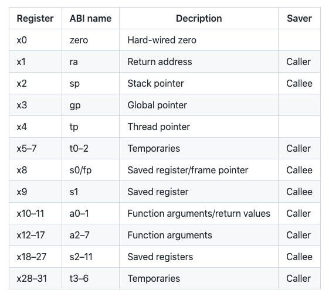

# Introduction

## Instruction set

被计算机体系结构所理解的命令的词汇表 （指令集）

## Stored-program concept

在这种概念里，指令以及相关数据都被存储在内存中（Memory）

## 相关指令集如下：


# 2.2 计算机硬件的操作(Operations of Computer Hardware)

任何计算机都能进行运算操作。

在RISC-V中，例如加法运算可用如下指令表示：

```apl
a=b+c
d=a-e
```

```assembly
add a, b, c //a=b+c
sub d, a, e //d=a-e
```

```apl
f=(g+h)-(i+j)
```

```assembly
add t0, g, h //将运算结果存储在临时变量t0中
add t1, i, j
sub f, t0, t1
```

很明显，运算操作中，每一条指令都有三个操作数，两个用于计算，一个用于存储结果。这种思想体现了一种原则：有规律的往往是简单的 （Simplicity favors regularity）

# 2.3 计算机硬件的操作数 (Operands of Computer Hardware)

## Operands

用于进行计算操作的数

这些操作数必须被读取到寄存器中进行运算（register），在RISC-V中，register的大小是64 bits。RISC-V中有32个register，operands 必须取自32个64bits的register之中。

## double word

64 bits

## word

32 bits

## 用寄存器的指令集

```apl
f=(g+h)-(i+j)
```

假设变量f,g,h,i,j分别存储在x19,x20,x21,x22,x23

```assembly
add x5, x20, x21 //临时变量存储在寄存器x5 x6中
add x6, x22, x23
sub x19, x5, x6
```

## 内存操作数 （Memory Oprands）

由于寄存器的数量很少，并且运算只能在寄存器上进行，所以一些结构体数据和数组数据都存储在内存中（Memory）。RISC-V提供了在寄存器和内存中传输数据的指令，要获得内存中的数据，指令必须有数据在内存中的地址（操作数之一）。内存是一个很大的一维的数组，地址相当于对数组的引用，从0开始，在RISC-V中每个单元代表一个byte (8 bits)。

*数据从内存传输到寄存器叫做 load* ，加载doubleword 的指令是 ld 。例如：

```apl
g=h+A[8]
```

 假设变量g,h存储在x20,21，数组的地址存储在x22

```assembly
ld x9, 64(x22) // 先将A[8]从内存中读取到寄存器x8中作为临时变量，由于doubleword是8字节，8个doubleword需要64字节
add x20, x21, x9 //g=h+A[8]
```

*数据从寄存器存储到内存中叫做 store*，存储doubleword的指令是 sd。例如：

```apl
A[12]=h+A[8]
```

假设如上

```assembly
ld x9, 64(x22) //临时变量存储到x9
add x9, x9, x21
sd x9, 96(x22) //A[12]=h+A[8]
```

## 操作数之常量和立即数(Constant or Immediate Operands)

寄存器中读取数据和操作数据是最快的，有的时候指令中需要常数，但是常数存储在内存中，这样会大大降低效率，例如：

```assembly
ld x9, ConstantOffset(x3) //x9=constant constant在内存中
add x22, x22, x9 //x22=x22+x9 x9相当于是常数
```

RISC-V提供了可以直接运算常量的指令，例如add immediate ==> addi，例如:

```assembly
addi x22, x22, 4 //x22=x22+4
```

常量0是寄存器x0，x0被硬接线为0。

# 2.4 符号数和无符号数（Signed and Unsigned Numbers）

## binary digit

简称bit，二进制其中之一，0或1

## least significant bit

在RISC-V中，一个doubleword中最右边的bit是*least significant bit*

## most significant bit

同样的，一个doubleword中最左边的bit是*most significant bit*

一个doubleword可以表示0～$$2^{64}-1$$的数，n位的二进制可以表示0~$$2^{n}-1$$的数，可以通过等比数列求和计算得出。

## Two's complement (二的补码)

为了使计算机能够运算负数，并且为了简单化，最终的解决方法就是使用*Two's complement*，即把doubleword的*leading 0s*（第63位及往左都是0）表示正数，*leading 1s*（第63位及往左都是1）表示负数。例如：
$$
\begin{aligned}
00000000\,00000000\,00000000\,00000000\,00000000\,00000001&=1_{ten}\\
10000000\,00000000\,00000000\,00000000\,00000000\,00000001&=-2^{63}+1_{ten}\\
11111111\,11111111\,11111111\,11111111\,11111111\,11111101&=-2^{63}+2^{63}-1-2^{1}=-3_{ten}
\end{aligned}
$$
计算时将第63位的数字乘以负数加上62~0位的所有数字。*signed doubleword*能表示 $$-2^{63}$$~$$2^{63}-1$$的数。

## 计算符号数字的简便方法

### 倒置法 （invert 0 to  1 and 1 to 0）

在符号数字中111…111表示-1，所以$$\bar{x}+x=-1$$，因此$$\bar{x}+1=-x$$ ($$\bar{x}$$表示$$x$$的倒置)。例如：
$$
\begin{aligned}
x=&00000000\,00000000\,00000000\,00000000\,00000000\,00000010=2_{ten}\\
\bar{x}=&11111111\,11111111\,11111111\,11111111\,11111111\,11111101\\
\bar{x}+1=&11111111\,11111111\,11111111\,11111111\,11111111\,11111101\\+\\
&00000000\,00000000\,00000000\,00000000\,00000000\,00000001\\
=&11111111\,11111111\,11111111\,11111111\,11111111\,11111110\\
=&-2_{ten}
\end{aligned}
$$

# 2.5 在计算机中表示指令集(Representing Instructions in the Computer)

指令集在计算机中以一系列高低电信号村粗。指令集的每一部分都可以被看作一个独立的数字，将这些数字放在一起就能形成指令。RISC-V中的32个寄存器可以从0~31引用。

## 将汇编翻译成机器指令

例如：

```assembly
add x9, x20, x21
```

十进制表示法是

```apl
0 21 20 0 9 51
```

该指令的每一个数字成为一个字段（field），第一个，第四个，第六个字段（0 0 51）一起告诉计算机该指令执行加法操作（addition）。第二个字段（21）表示第二个源操作数寄存器的数字（x21），第三个字段（20）表示另外一个源操作数寄存器的数字，第五个字段（9）表示存放最终结果的寄存器的数字（x9）。该指令也可以表示为二进制数字：

| 0000000 | 10101  | 10100  |  000   | 01001  | 0110011 |
| :-----: | :----: | :----: | :----: | :----: | :-----: |
| 7 bits  | 5 bits | 5 bits | 3 bits | 5 bits | 7 bits  |
|    0    |   21   |   20   |   0    |   9    |   51    |
| funct7  |  rs2   |  rs1   | funct3 |   rd   | opcode  |

RISC-V的每一条指令都是32bits大小，上图表格中的指令布局称为指令格式（instruction format）。

### Machine language

为了与汇编语言区分，二进制表示的指令称为机器语言。

## RISC-V字段（field）

以上面的加法指令为例子，其中的字段可以表示成：

| funct7 |  rs2   |  rs1   | funct3 |   rd   | opcode |
| :----: | :----: | :----: | :----: | :----: | :----: |
| 7 bits | 5 bits | 5 bits | 3 bits | 5 bits | 7 bits |

以上字段的名字的意义是：

- **opcode** ：指令的基本操作
- **rd**：最终目标寄存器操作数，能够得到指令操作的结果
- **funct3**：额外的 opcode 字段
- **rs1**：第一个寄存器源操作数
- **rs2**：第二个寄存器源操作数
- funct7：额外的 opcode 字段

### opcode

一种能够指明操作和指令格式的字段

## R-type format (for register) 

R-type 格式如以上所示指令格式所示，主要用于寄存器的操作。

## I-type format (operation with one constant operand) 

I-type 格式主要用于有一个常数操作数的指令，例如*addi*、*load* 等等。大致上，I-type 格式如图示：

| immediate |  rs1   | funct3 |   rd   | opcode |
| :-------: | :----: | :----: | :----: | :----: |
|  12 bits  | 5 bits | 3 bits | 5 bits | 7 bits |

12bit 大小的immediate代表二的补码的数值，即可以表示$$-2^{11}$$~$$2^{11}-1$$的十进制数值。当I-type 用于load指令时，immediate代表字节偏移量（byte offset），rs1表示存储内存中起始地址（base address）的寄存器源操作数，相当于在内存地址中寻找*rs1+immediate*。因此*ld* (load doubleword) 指令能够在*rs1*(base address)的基础上寻找地址在区域$$\pm{2^{11}}$$之间的doublewords。

## S-type format (split immediate into two fields)

S-type 格式将immediate分成了两个字段，这样做是为了保持rs1和rs2在所有指令格式中处于相同的位置，如*sd*（store doubleword）。其中的字段如下：

| immediate[11:5] |  rs2   |  rs1   | funct3 | immediate[4:0] | opcode |
| :-------------: | :----: | :----: | :----: | :------------: | :----: |
|     7 bits      | 5 bits | 5 bits | 3 bits |     5 bits     | 7 bits |

同样的，所有指令中opcode 和 funct3也同样在一样的位置，指令的格式通过opcode进行区分，所以opcode位于二进制的第一个位置，硬件首先读取opcode，之后才能知道怎样处理剩下的指令部分。

## 举例

假设数组A的基础地址是x10，变量h存储在x21，翻译成机器语言：

```apl
A[30]=h+A[30]+1;
```

首先翻译成汇编：

```apl
ld x9, 240(x10) //将A[30]从内存读取到临时寄存器x9
add x9, x21, x9 //x9=A[30]+h
addi x9, x9, 1 //x9=x9+1
sd x9, 240(x10) //将最终结果存储到A[30]
```

其次将每条指令翻译成机器语言

*ld x9, 240(x10)*：

|  immediate   |  rs1  | funct3 |  rd   | opcode  |
| :----------: | :---: | :----: | :---: | :-----: |
|     240      |  10   |   3    |   9   |    3    |
| 000011110000 | 01010 |  011   | 01001 | 0000011 |

*add x9, x21, x9*：

| funct7  |  rs2  |  rs1  | funct3 |  rd   | opcode  |
| :-----: | :---: | :---: | :----: | :---: | :-----: |
|    0    |   9   |  21   |   0    |   9   |   51    |
| 0000000 | 01001 | 10101 |  000   | 01001 | 0110011 |

*addi x9, x9, 1*：

|  immediate   |  rs1  | funct3 |  rd   | opcode  |
| :----------: | :---: | :----: | :---: | :-----: |
|      1       |   9   |   0    |   9   |   19    |
| 000000000001 | 01001 |  000   | 01001 | 0010011 |

*sd x9 240(x10)*

| immediate[11:5] |  rs2  |  rs1  | funct3 | immediate[4:0] | opcode  |
| :-------------: | :---: | :---: | :----: | :------------: | :-----: |
|        7        |   9   |  10   |   3    |       16       |   35    |
|     0000111     | 01001 | 01010 |  011   |     10000      | 0100011 |

# 2.6逻辑操作（Logical Operations）

|                逻辑操作                 | C 操作符号 | Java 操作符号 | RISC-V 指令 |
| :-------------------------------------: | :--------: | :-----------: | :---------: |
|            Shift Left (左移)            |     <<     |      <<       |  sll, slli  |
|           Shift Right (右移)            |     >>     |      >>>      |  srl, srli  |
| Shift Right arithmetic (可以计算符号数) |     >>     |      >>       |  sra, srai  |
|             Bit-by-bit AND              |     &      |       &       |  and, andi  |
|              Bit-by-bit OR              |     \|     |      \|       |   or, ori   |
|             Bit-by-bit XOR              |     ^      |       ^       |  xor, xori  |
|             Bit-by-bit NOT              |     ~      |       ~       |    xori     |


# 2.8 Procedures



## Nested Procedures

```c
long long int fact (long long int n)
{
    if (n<1)
        return 1;
    else
        return n*fact(n-1);
}
```

```assembly

```

# 2.10 

