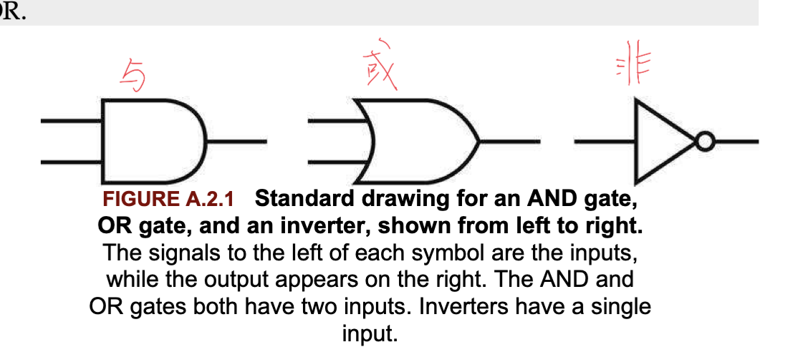

# 4.0 前置知识

## 门电路 真值表 与逻辑等式

### 逻辑块(Logic Block)

逻辑块分为两种类型，取决于能否存储记忆。没有存储记忆的逻辑块叫作**组合式**，输出只取决于当前的输入；在能够存储记忆的逻辑块中，输出同时取决于当前输入与存储的值（该存储的值叫作逻辑块的状态 state）。

## 组合式逻辑

一种没有存储功能的逻辑系统

## 时序逻辑（sequential logic)

能够存储记忆的逻辑系统

## 真值表

略

## 布尔代数

- **或** ：写作‘+’，例如A+B
- **与**：写作*(乘法)，例如AB
- **非**：写作$\overline{A}$。

### 一些公式

- $A+\overline{A}=1$ and $A*\overline{A}=0$
- $A*(B+C)=(A*B)+(A*C)$ and $A+(B*C)=(A+B)*(A+C)$

### 德摩根定律

$$
\overline{A+B}=\overline{A}*\overline{B}\\
\overline{A*B}=\overline{A}+\overline{B}
$$

## 门电路

一般都不会显示的画出非门，仅使用一个圆圈表示，例如：

## 组合式逻辑电路

### 译码器(Decoders)

常见的译码器是输入n比特并且输出$2^n$比特，但是每一种输入只有一位输出是1，例如：

### 多路选择器(Multiplexors)

多路选择器也可以叫做selector，因为他的输出就是他的输入的其中之一。来看下面的例子：

输入是A和B，S表示选择信号，C表示输出，当S=1时，输出B，当S=0时输出A，逻辑表达式为：$A*\overline{S}+B*S$。

如果有n位的输入，那么多路选择器就需要$log_2^n$位的选择信号。

## PLA 和两级逻辑电路

### Sum of Products

乘积的和表示多个与门输入到或门之中，因为与门表示乘积而或门表示和。

### Products of Sum

同样的，和的乘积表示多个或门输入到与门之中。

任何逻辑表达式都能从真值表得到。逻辑表达式是输出为1的各项乘积之和。例如：

其中输出为D(这图画的不清楚)。那么当D为1时，有这几项：
$$
\overline{A}*\overline{B}*C\\
\overline{A}*B*\overline{C}\\
A*\overline{B}*\overline{C}\\
A*B*C
$$
把他们相加就能得到相应的逻辑表达式：
$$
\overline{A}*\overline{B}*C+\overline{A}*B*\overline{C}+A*\overline{B}*\overline{C}+A*B*C=D
$$
并且从逻辑表达式中可以设计出相应的逻辑门电路，其中乘积项的个数即为与门的个数，也是或门的输入个数。

接下来请看多个输出的情况，与门的个数取决于最多的输出为1的个数：

其中输入为A B C，输出为D E F，可以根据真值表写出逻辑表达式，这里省略了。其逻辑电路为：

# 4.1 逻辑设计约定

RISC-V实现的数据通路(datapath)中包含两种逻辑元素，**一种叫做组合式逻辑电路(combinational)，其输出只取决于当前的输入，即没有记忆存储；另一种叫做状态单元(state element)，可以记忆存储，也就是拔掉电源后能够恢复之前的数值，比如寄存器、主存等等。**

一个状态单元至少有两个输入和一个输出。需要的输入是**所需要写入状态单元的数据**和**指定何时写入数据的时钟(clock)**，状态单元的输出提供了在前一个时钟周期输入的值(即之前存储的值)。状态单元可以在任何时间被读取。

包含状态的逻辑组件又叫做时序的，因为他们的输出同时取决于输入和内部状态。

## 时钟同步方法（Clocking Methodology）

Clocking methodology 是一种用来决定数据相对于时钟来说何时有效和稳定的方法，比如决定一个信号什么时候可以被读取或者被写入，这是十分重要的，因为如果一个信号在被写入的同时又在被读取，那么被读取的值是不确定的。Clocking methodology就是用来使硬件可以被预测。

## Edge-triggered clocking(边缘触发时钟)

在此时钟方法中，所有状态的改变仅发生于时钟的**边界**。也就是说，任何在时序逻辑组件中存储的值只可以在时钟边界被更新！**所谓时钟边界是指由低电压到高电压（反之亦然）的快速转变！**所有组合式逻辑组件的输入都必须来自状态单元并且输出到另一个状态单元集合，其输入是在上一个时钟周期被写入的值，其输出将会用于下一个时钟周期。

在上图中，**在一个时钟周期之内**，所有信号从状态单元1开始传播，通过组合式逻辑组件，并且到达了状态单元2。**信号抵达状态单元2的时间决定了时钟周期的长度**。

在同步数字系统中，时钟决定了状态单元何时将值写入内部存储中，任何输入到状态单元的值都必须在激活的时钟边沿将它写入状态单元之前到达稳定。

## control signal 控制信号

控制信号用于在多路选择器中指定功能单元(functional unit)的操作。

为了简化，我们在状态单元在任何激活的时钟边沿被写入时都不会说明**写入控制信号**，只有当状态单元不是在每个时钟边沿都更新（why?）时才需要一个写入控制信号。**时钟信号和写入控制信号都是状态单元的输入，只有当写入信号有效并且处于时钟边沿时，状态单元的状态才被改变。** 

## Asserted 有效

我们用有效来指明逻辑高或真（即1）

## deasserted 无效

无效表示逻辑低或假，即0.

